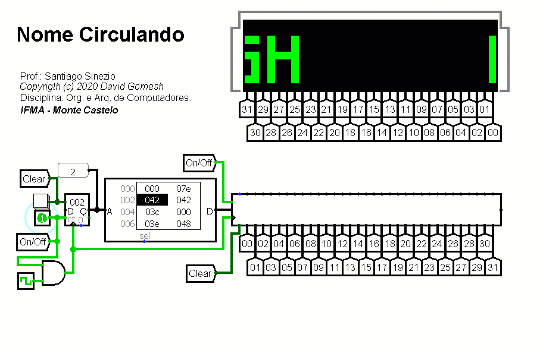
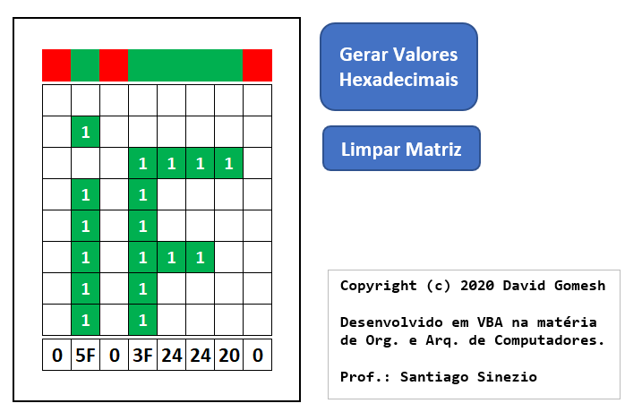

# Palavras Girando no Logisim

## Sobre o Projeto

- Aluno: **David Gomesh**
- Professor: **Santiago Sinezio**
- Curso: **Sistemas de Informação**
- Disciplina: **Organização e Arquitetura de Computadores**
- Instituição: **IFMA - Monte Castelo**

## Exemplo de frase

|  |
| - |
| *Nome girando na Matriz de LED* |

## Códigos Hexadecimais para palavras

Usando o programa escrito em **C** na pasta **Codificador HEX**, pode se gerar facilmente o código hexadecimal para uma frase de até 512 caracteres! Duas fontes disponíveis.

## Novos formatos

Também é possível criar novos formatos usando a planilha (criada no Excel) na pasta **Gerador HEX**. 

Basta desenhar o formato usando o caractere **1**, simulando um código binário. Após desenhar, clique no botão *"Gerar Valores Hexadecimais"*.

|  |
| - |
| *Gerador de novos formatos* |

O botão **"Gerar Valores Hexadecimais"** foi programado usando a Linguagem VBA (Visual Basic for Applications). O código fonte está disponível na planilha, devendo ser habilitado no momento em que se inicia a mesma. Também foi disponibilizado o código separado na pasta da planilha.
